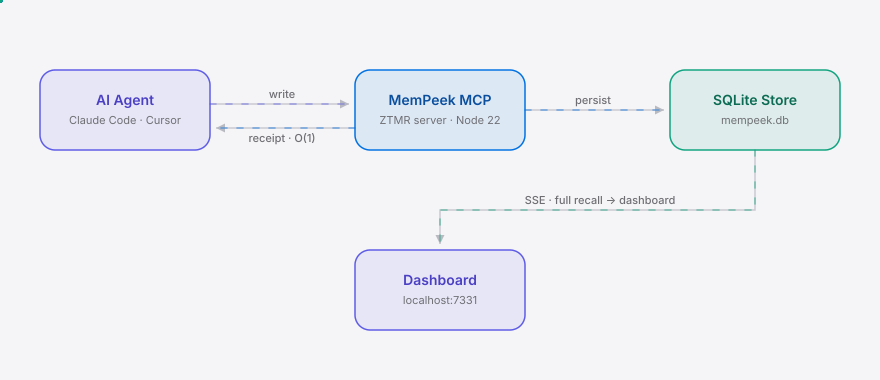

<div align="right"><sub><b>English</b>&nbsp;&nbsp;⇄&nbsp;&nbsp;<a href="./README.md">中文</a></sub></div>

<picture>
  <source media="(prefers-color-scheme: dark)" srcset="./assets/hero-dark.svg">
  <source media="(prefers-color-scheme: light)" srcset="./assets/hero-light.svg">
  
</picture>

<p align="center"><sub>MemPeek is the zero-token memory readback that returns what agents know without bloating context.</sub></p>

**Every time your AI agent recalls a memory, it injects that fact back into the context window — and you pay for it in tokens. MemPeek routes recall to a local dashboard; the model gets only a fixed-size receipt.**

<p align="center">
  <a href="./LICENSE"></a>
  &nbsp;<a href="https://github.com/SuperMarioYL/mempeek/releases"></a>
  &nbsp;<a href="https://github.com/SuperMarioYL/mempeek/actions/workflows/ci.yml"></a>
  &nbsp;
  &nbsp;
  &nbsp;
</p>

## Contents

- [Architecture](#architecture)
- [Why this exists](#why-this-exists)
- [Install & Quickstart](#install--quickstart)
- [Usage](#usage)
- [Demo](#demo)
- [Configuration](#configuration)
- [Pricing](#pricing)
- [How it differs from claude-mem](#how-it-differs-from-claude-mem)
- [Roadmap](#roadmap)
- [License](#license)

<h2> Architecture</h2>

<picture>
  <source media="(prefers-color-scheme: dark)" srcset="./assets/atlas-dark.svg">
  <source media="(prefers-color-scheme: light)" srcset="./assets/atlas-light.svg">
  
</picture>

The core primitive is **Zero-Token Memory Readback (ZTMR)** — a split-return protocol: a readback query produces two outputs. The full recall goes to an SSE side-channel (your dashboard); the model's context window receives only an O(1) fixed-size receipt `{found, displayed, token_saved, side_channel}`. The zero-token property holds because the receipt's size is independent of recall volume — a 3-entry recall and a 3000-entry recall both return the same constant shape.

Two processes: your agent and MemPeek (MCP-over-stdio + HTTP dashboard in one process). No microservices, no cloud, no Kubernetes. A single SQLite file is the only persistent state.

<h2> Why this exists</h2>

Today's agent memory systems work by **injection** — every recall writes facts back into the context window, and every turn spends tokens. Across a 200-turn session, injected memory crowds out the working reasoning space, raising per-call cost and truncating effective reasoning length in lockstep. The Zero-Mem paper (arxiv 2607.29377) named this primitive "zero-token memory operations" in 2026, but no one has shipped it as an installable tool yet.

MemPeek does not compete with injection tools on who injects smarter. It opens a zero-token **readback side-channel**: the agent writes memories as usual, but when code or you ask "what do I know about the deployment config," the full recall flows to a local dashboard and the model receives only a fixed receipt. Open `localhost:7331` and see — at a glance — what the agent remembers, what's actually in context right now, and how many tokens you've saved cumulatively.

<h2> Install & Quickstart</h2>

```bash
git clone https://github.com/SuperMarioYL/mempeek && cd mempeek
npm install && npm run build
node dist/index.js          # MCP stdio + dashboard at http://localhost:7331
```

Wire MemPeek into Claude Code (one line):

```bash
claude mcp add mempeek node "$(pwd)/dist/index.js"
# Cursor: add the same command in your MCP config JSON
```

First visible result (under 2 minutes):

```bash
node dist/index.js --demo   # demos the ZTMR split-return + budget comparison in your terminal
```

<details><summary>sample demo output</summary>

```
▶ Readback #1: "what do I know about the deployment config?"
  → model context receives (constant-size receipt, O(1)):
    {"found":5,"displayed":true,"token_saved":114,"side_channel":"http://localhost:7331"}
  → dashboard side-channel receives (full recall, 5 entries — never enters context):
    [recall]    the embeddings index uses pgvector on the read replica; 1536-dim…
    [in-context] deployment config: prod runs on us-east-1, 3x c6i.2xlarge behind an ALB…
  → saved this readback: 114 tokens

── Context-budget comparison ──────────────────────────────────────
  injection-based memory (baseline):    326 tokens into context (full recall each readback)
  MemPeek side-channel readback:         66 tokens into context (constant-size receipts only)
  context tokens avoided:               326 tokens kept out of the window
```
</details>

<h2> Usage</h2>

The three most common workflows:

```bash
# 1) Normal use: MCP stdio server + dashboard in one process (the agent connects to this)
node dist/index.js --db ~/mempeek.db --session proj-alpha

# 2) Dashboard only, reviewing an existing store (no stdio — doesn't touch the agent)
node dist/index.js --http-only --db ~/mempeek.db
#   open http://localhost:7331 in your browser

# 3) Bounded demo: seed memories + readbacks + budget comparison, then exit
node dist/index.js --demo --seed 14
```

The two MCP tools the agent calls:

```ts
// Write a memory (embedding optional; omitted → built-in deterministic vectorizer)
mempeek.write({ content, in_context?: boolean, session_id?: string })

// Zero-token readback: the model gets only a constant receipt; full recall goes via SSE to the dashboard
mempeek.readback({ query, top_k?: number })
// → {"found":3,"displayed":true,"token_saved":847,"side_channel":"http://localhost:7331"}
```

Cursor MCP config (`~/.cursor/mcp.json`):

```json
{
  "mcpServers": {
    "mempeek": { "command": "node", "args": ["/abs/path/to/mempeek/dist/index.js"] }
  }
}
```

<h2> Demo</h2>

`mempeek --demo` demonstrates the ZTMR split-return in your terminal: the model receives only a constant receipt, the dashboard side-channel gets the full recall, and an injection-baseline vs side-channel context-budget comparison prints.


> To re-render locally: `vhs docs/demo.tape` (requires vhs + ffmpeg).

<h2> Configuration</h2>

| Flag | Type | Default | Meaning |
|---|---|---|---|
| `--db` | path | `mempeek.db` | SQLite path (only persistent state) |
| `--port` | int | `7331` | Dashboard port |
| `--host` | string | `127.0.0.1` | Listen address (localhost only) |
| `--session` | string | `default` | Session id, scopes recall |
| `--demo` | flag | — | Run a bounded demo and exit (no servers) |
| `--http-only` | flag | — | Dashboard only, no MCP stdio |
| `--mcp-only` | flag | — | MCP stdio only, no dashboard |
| `--seed` | int | `14` | Number of seeded demo memories |

Recall uses cosine similarity. Callers may pass `embedding` (from the agent's own embedding provider) for precise recall; if omitted, a built-in deterministic vectorizer (hashed bag-of-words — not a trained model, fallback only) is used. This honors the "use the agent's existing embedding provider" boundary — MemPeek trains no models, ships no reranker.

<h2> Pricing</h2>

| Tier | Price | For |
|---|---|---|
| **Self-hosted local** | Free, forever | Solo long-session creators (Claude Code / Cursor) |
| **Hosted team tier** (roadmap) | ¥39/seat/mo (≈ $6), billed annually | 3–10 person AI-content teams; shared recall across sessions + team savings report |

v0.1 is local-free and local-first (`npx mempeek` + a local SQLite file; data never leaves your machine). The paid layer is the future hosted team tier — a multi-tenant shim over the same readback protocol: aggregate every teammate's `mempeek.readback` receipts into one view ("what our agents know + what we saved this week"). A team lead's card-out moment is that team-wide savings report, not the install. Cloud/billing stack plan: Cloudflare Workers + D1/R2 (D1 keeps the SQLite DNA) + Stripe / WeChat Pay / Alipay.

<h2> How it differs from claude-mem</h2>

| Axis | MemPeek (readback) | [claude-mem](https://github.com/thedotmack/claude-mem) (injection, 90k★) |
|---|---|---|
| Memory access model | Side-channel readback; recall stays out of context | Injection; recall written back into context |
| Per-recall token cost | O(1) fixed receipt | Proportional to recall volume |
| Recall-vs-in-context UI | Yes (three-panel dashboard) | No (black-box injection) |
| Adoption / community size | Early; no existing users to learn from | Vast (90k★; injection works out of the box) |

claude-mem proves developers want agent memory **at scale** — that's a pain signal, not a demand signal for this product. Its injection thesis is structurally **opposite** to a readback side-channel: adding one means telling users "your recalled memory is now not in the prompt," which contradicts claude-mem's headline promise to "inject relevant context back." So the injection incumbent won't add a side-channel on its own — that's MemPeek's window. Honest caveat: on "install-and-go + breadth of capture," claude-mem is far ahead today; MemPeek is only better on the narrow axis of zero-token access + recall visibility.

<h2> Roadmap</h2>

- [x] **m1** MCP server + ZTMR readback (receipt → model, full recall → SSE side-channel)
- [x] **m2** Local dashboard (recall list, in-context items, token-savings counter + sparkline, live SSE)
- [ ] **m3** `npx mempeek` one-shot installer + 200-turn demo session + before/after budget graph (currently a stub)
- [ ] Hosted team tier: shared recall dashboard across sessions + team savings report
- [ ] Cross-provider protocol: unified readback view for Claude / OpenAI / Gemini
- [ ] Composable bridge with injection tools (claude-mem writes → MemPeek readback)

**Kill criteria** (falsifiable within 45 days):

1. If a model provider ships native zero-token memory readback in its API, the side-channel is unreachable at the product layer → kill.
2. If 4 of 5 early users prefer smarter injection over a readback side-channel → kill (demand misread).
3. After 30 days on GitHub: <50 stars AND no organic issue or real-session report → kill.

<h2> License</h2>

MIT — see [LICENSE](./LICENSE). File bugs in [Issues](https://github.com/SuperMarioYL/mempeek/issues) or improvements via [PR](https://github.com/SuperMarioYL/mempeek/pulls).

## Share this

```
MemPeek — zero-token memory readback for AI agents. Your agent recalls what it knows without bloating context: the model gets a fixed-size receipt, full recall flows to a local dashboard. ~40% fewer context tokens on a 200-turn session. https://github.com/SuperMarioYL/mempeek
```

<p align="center"><sub><a href="./LICENSE">MIT</a> © 2026 SuperMarioYL</sub></p>
