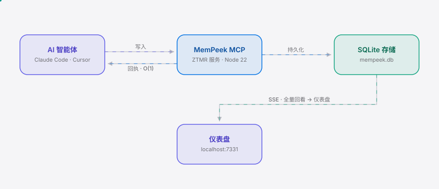

<div align="right"><sub><a href="./README.en.md">English</a>&nbsp;&nbsp;⇄&nbsp;&nbsp;<b>简体中文</b></sub></div>

<picture>
  <source media="(prefers-color-scheme: dark)" srcset="./assets/hero-cn-dark.svg">
  <source media="(prefers-color-scheme: light)" srcset="./assets/hero-cn-light.svg">
  
</picture>

<p align="center"><sub>MemPeek 是零 token 记忆回看工具——agent 记得什么，不占上下文就能看见。</sub></p>

**AI agent 每次回忆都把记忆塞进上下文窗口，烧的是你的 token——MemPeek 把召回送到本地仪表盘，模型只收到一个固定大小的回执。**

<p align="center">
  <a href="./LICENSE"></a>
  &nbsp;<a href="https://github.com/SuperMarioYL/mempeek/releases"></a>
  &nbsp;<a href="https://github.com/SuperMarioYL/mempeek/actions/workflows/ci.yml"></a>
  &nbsp;
  &nbsp;
  &nbsp;
</p>

## 目录

- [架构](#架构)
- [为什么需要](#为什么需要)
- [安装与快速开始](#安装与快速开始)
- [用法](#用法)
- [Demo](#demo)
- [配置](#配置)
- [定价](#定价)
- [与 claude-mem 的差异](#与-claude-mem-的差异)
- [路线图](#路线图)
- [License](#license)

<h2> 架构</h2>

<picture>
  <source media="(prefers-color-scheme: dark)" srcset="./assets/atlas-cn-dark.svg">
  <source media="(prefers-color-scheme: light)" srcset="./assets/atlas-cn-light.svg">
  
</picture>

核心原语是 **零 token 记忆回看（Zero-Token Memory Readback, ZTMR）**——一条分裂返回协议：回看查询产生两份输出，全量召回走向 SSE 旁路（你的仪表盘），模型上下文只收到一个 O(1) 的固定回执 `{found, displayed, token_saved, side_channel}`。零 token 性质成立，是因为回执大小与召回量无关：3 条召回和 3000 条召回返回的都是同一个常量结构。

两个进程：你的 agent 和 MemPeek（MCP-over-stdio + HTTP 仪表盘同进程）。没有微服务、没有云、没有 Kubernetes。一个 SQLite 文件是唯一的持久化状态。

<h2> 为什么需要</h2>

今天的 agent 记忆系统靠**注入**工作——每次召回都把事实写回上下文窗口，每一轮都在烧 token。200 轮长会话下来，注入的记忆把有效推理空间挤占殆尽，单次调用成本和截断风险同步攀升。Zero-Mem 论文（arxiv 2607.29377）在 2026 年把这个原语命名为「零 token 记忆操作」，但还没有人把它做成可装的工具。

MemPeek 不和注入派比谁注入得更聪明。它给记忆开一条零 token 的**回看旁路**：agent 照常写入记忆，但当代码或你问「我对部署配置都知道些什么」时，全量召回流向本地仪表盘，模型只收到一个固定回执。你打开 `localhost:7331`，一眼看清 agent 记住了什么、哪些此刻在上下文里、累计省下了多少 token。

<h2> 安装与快速开始</h2>

```bash
git clone https://github.com/SuperMarioYL/mempeek && cd mempeek
npm install && npm run build
node dist/index.js          # MCP stdio + 仪表盘 http://localhost:7331
```

把 MemPeek 接到 Claude Code（一行）：

```bash
claude mcp add mempeek node "$(pwd)/dist/index.js"
# Cursor：在 MCP 配置 JSON 里加同一条 command
```

看到第一个结果（不到 2 分钟）：

```bash
node dist/index.js --demo   # 在终端演示 ZTMR 分裂返回 + 节省预算对比
```

<details><summary>demo 示例输出</summary>

```
▶ Readback #1: "what do I know about the deployment config?"
  → model context receives (constant-size receipt, O(1)):
    {"found":5,"displayed":true,"token_saved":114,"side_channel":"http://localhost:7331"}
  → dashboard side-channel receives (full recall, 5 entries — never enters context):
    [recall]    the embeddings index uses pgvector on the read replica; 1536-dim…
    [in-context] deployment config: prod runs on us-east-1, 3x c6i.2xlarge behind an ALB…
  → saved this readback: 114 tokens

── Context-budget comparison ──────────────────────────────────────
  injection-based memory (baseline):    326 tokens into context (full recall each readback)
  MemPeek side-channel readback:         66 tokens into context (constant-size receipts only)
  context tokens avoided:               326 tokens kept out of the window
```
</details>

<h2> 用法</h2>

三个最常见的工作流：

```bash
# 1) 正常使用：MCP stdio 服务 + 仪表盘同进程（agent 连这一条）
node dist/index.js --db ~/mempeek.db --session proj-alpha

# 2) 只起仪表盘，回看已有 store（不开 stdio，不打扰 agent）
node dist/index.js --http-only --db ~/mempeek.db
#   浏览器打开 http://localhost:7331

# 3) 有界 demo：种子记忆 + 回看 + 预算对比，跑完即退出
node dist/index.js --demo --seed 14
```

agent 侧调用的两个 MCP 工具：

```ts
// 写入一条记忆（embedding 可选；不传则用内置确定性向量化）
mempeek.write({ content, in_context?: boolean, session_id?: string })

// 零 token 回看：模型只收到常量回执，全量召回走 SSE 到仪表盘
mempeek.readback({ query, top_k?: number })
// → {"found":3,"displayed":true,"token_saved":847,"side_channel":"http://localhost:7331"}
```

Cursor 的 MCP 配置（`~/.cursor/mcp.json`）：

```json
{
  "mcpServers": {
    "mempeek": { "command": "node", "args": ["/abs/path/to/mempeek/dist/index.js"] }
  }
}
```

<h2> Demo</h2>

`mempeek --demo` 在终端演示 ZTMR 分裂返回：模型只收到常量回执，仪表盘旁路拿到全量召回，并打印注入基线 vs 旁路回看的上下文预算对比。


> 想本地重渲染：`vhs docs/demo.tape`（需 vhs + ffmpeg）。

<h2> 配置</h2>

| Flag | 类型 | 默认 | 说明 |
|---|---|---|---|
| `--db` | path | `mempeek.db` | SQLite 路径（唯一持久化状态） |
| `--port` | int | `7331` | 仪表盘端口 |
| `--host` | string | `127.0.0.1` | 监听地址（仅本机） |
| `--session` | string | `default` | 会话 id，用于隔离召回范围 |
| `--demo` | flag | — | 跑有界 demo 后退出（不起服务） |
| `--http-only` | flag | — | 仅起仪表盘，不启 MCP stdio |
| `--mcp-only` | flag | — | 仅启 MCP stdio，不起仪表盘 |
| `--seed` | int | `14` | demo 种子记忆条数 |

记忆召回用 cosine 相似度。调用方可传 `embedding`（来自 agent 自己的 embedding provider）做精确召回；不传则用内置确定性向量化（哈希词袋，非训练模型，仅作 fallback）。这符合「用 agent 现有 embedding provider」的边界——MemPeek 不训练模型、不做 reranker。

<h2> 定价</h2>

| 档位 | 价格 | 适合 |
|---|---|---|
| **本地自托管** | 免费、永久 | 单人长会话创作者（Claude Code / Cursor） |
| **团队托管层**（roadmap） | ¥39/seat/月（≈ $6），年付 | 3–10 人 AI 内容团队，跨会话共享召回 + 团队节省报表 |

v0.1 是本地免费、本地优先（`npx mempeek` + 本地 SQLite，数据不出本机）。付费的是未来的团队托管层——在同一个回看协议上叠加多租户 shim：聚合全团队的 `mempeek.readback` 回执成一个视图（「我们的 agent 都知道什么 + 本周省了多少」）。团队负责人的掏卡时刻是那张团队节省报表，不是安装。云/计费栈规划：Cloudflare Workers + D1/R2（D1 保留 SQLite DNA）+ Stripe / 微信支付 / 支付宝。

<h2> 与 claude-mem 的差异</h2>

| 维度 | MemPeek（回看派） | [claude-mem](https://github.com/thedotmack/claude-mem)（注入派，90k★） |
|---|---|---|
| 记忆访问模型 | 旁路回看，召回不进上下文 | 注入，召回写回上下文 |
| 每次 recall 的 token 成本 | O(1) 固定回执 | 与召回量成正比 |
| 召回 vs 上下文 UI | 有（仪表盘三面板） | 无（黑盒注入） |
| 采纳门槛 / 社区规模 | 早期，无现成用户可学 | 极高（90k★，注入即开即用） |

claude-mem 证明了开发者**大规模**需要 agent 记忆——那是痛点信号，不是对本产品的需求信号。它的注入论点和回看旁路**结构相反**：加一条旁路等于告诉用户「你召回的记忆现在不在 prompt 里了」，这与它「把相关上下文注入回下次会话」的承诺矛盾。所以注入派不会主动加旁路——这是 MemPeek 的窗口。诚实地说，在「开箱即用、广度采集」上 claude-mem 现在远胜 MemPeek；MemPeek 只在「零 token 访问 + 召回可视化」这一窄面上更好。

<h2> 路线图</h2>

- [x] **m1** MCP server + ZTMR 回看（receipt → 模型，全量召回 → SSE 旁路）
- [x] **m2** 本地仪表盘（回看列表、上下文条目、token 节省计数器 + sparkline，实时 SSE）
- [ ] **m3** `npx mempeek` 一键安装 + 200 轮 demo session + before/after 预算图（当前为 stub）
- [ ] 团队托管层：跨会话共享召回仪表盘 + 团队节省报表
- [ ] 跨 provider 协议：Claude / OpenAI / Gemini 统一回看视图
- [ ] 与注入派工具的可组合桥接（claude-mem 写入 → MemPeek 回看）

**Kill criteria**（45 天内可证伪）：

1. 若模型厂商在 API 里原生上线零 token 记忆回看，旁路在产品层不可达 → kill。
2. 若 5 个早期用户里 4 个更想要更聪明的注入而非旁路回看 → kill（需求误读）。
3. 上线 30 天后 GitHub <50 stars 且无有机 issue / 真实会话报告 → kill。

<h2> License</h2>

MIT，详见 [LICENSE](./LICENSE)。欢迎在 [Issues](https://github.com/SuperMarioYL/mempeek/issues) 报 bug 或在 [PR](https://github.com/SuperMarioYL/mempeek/pulls) 提改进。

## Share this

```
MemPeek — 零 token 记忆回看。你的 AI agent 记得什么，不占上下文就能看见；模型只收一个固定回执，全量召回流向本地仪表盘。200 轮会话省下 40% 上下文 token。https://github.com/SuperMarioYL/mempeek
```

<p align="center"><sub><a href="./LICENSE">MIT</a> © 2026 SuperMarioYL</sub></p>
