[English](README.en.md) | **简体中文**

<picture>
  <source media="(max-width: 640px) and (prefers-color-scheme: dark)" srcset="assets/presentation/hero-mobile-dark.svg">
  <source media="(max-width: 640px)" srcset="assets/presentation/hero-mobile-light.svg">
  <source media="(prefers-color-scheme: dark)" srcset="assets/presentation/hero-dark.svg">
  
</picture>

**完整召回内容送到本地仪表盘，MCP 返回精简回执，让人可以检查记忆而不把全文重复塞进模型上下文。**

`v0.2.0` · `Node.js 22+` · [MIT](LICENSE)

[Website](https://mempeek.lei6393.com) · [Demo record](docs/demo-results.json)

## 为什么使用

检查 Agent 记住了什么与让模型重新读取这些记忆，是两种不同操作。MemPeek 为前者提供本地回看路径：把命中的内容显示给人，模型拿到条数和地址等回执。模型若需要利用记忆全文，仍需由调用方另行提供。

## 架构

<picture>
  <source media="(max-width: 640px) and (prefers-color-scheme: dark)" srcset="assets/presentation/architecture-mobile-dark.svg">
  <source media="(max-width: 640px)" srcset="assets/presentation/architecture-mobile-light.svg">
  <source media="(prefers-color-scheme: dark)" srcset="assets/presentation/architecture-dark.svg">
  
</picture>

MemoryStore 将内容与向量写入 SQLite，按 cosine 相似度召回。MCP readback 将精简条目发布到 SSEBus，仪表盘经 HTTP/SSE 接收；回执只包含 found、displayed、token_saved、side_channel。默认向量来自哈希词袋，调用方也可提供向量。

源码入口：[src/index.ts](src/index.ts) · [src/mcp-server.ts](src/mcp-server.ts) · [src/memory-store.ts](src/memory-store.ts) · [src/readback.ts](src/readback.ts) · [src/dashboard/server.ts](src/dashboard/server.ts)

## 安装

需要 Node.js 22+。better-sqlite3 需要匹配本机 Node 的二进制；如果安装时没有可用预构建包，需要本机编译工具。

```bash
git clone https://github.com/SuperMarioYL/mempeek.git
cd mempeek
npm ci
npm run build
```

## 快速开始

脚本向临时 SQLite 写入两条记忆，显式按 demo 会话召回一条，并通过进程内 SSEBus 收到全文。没有启动模型或浏览器仪表盘。token_saved 是启发式内容估算。

```bash
node examples/presentation-demo.mjs
```

完整输入与执行步骤见上方命令及 [Demo 记录](docs/demo-results.json)。

## 使用

```bash
node dist/index.js --db mempeek.db --session project-a
node dist/index.js --http-only --db mempeek.db
node dist/index.js --demo --seed 14
```
仪表盘默认地址为 http://localhost:7331。MCP 客户端 command 使用 node，args 使用 dist/index.js 的绝对路径。工具 `mempeek.write` 接受 content；`mempeek.readback` 接受 query、top_k 与 session_id。需要隔离会话时，readback 应明确传 session_id。

200 轮模拟会话与 before/after 上下文预算对比：

```bash
node examples/demo-session.mjs
```

输出 [docs/demo-budget.json](docs/demo-budget.json)（逐次回看的累计注入/旁路 token）与 [docs/budget-graph.svg](docs/budget-graph.svg)（两条累计曲线对比图）；`--turns`、`--every` 可调规模。

## 实际 Demo

<picture>
  <source media="(max-width: 640px) and (prefers-color-scheme: dark)" srcset="assets/presentation/process-mobile-dark.svg">
  <source media="(max-width: 640px)" srcset="assets/presentation/process-mobile-light.svg">
  <source media="(prefers-color-scheme: dark)" srcset="assets/presentation/process-dark.svg">
  
</picture>

### 查看分开的返回值

model_receipt 不含全文，side_channel_content 包含匹配的记忆。

```text
$ node examples/presentation-demo.mjs
{
  "model_receipt": {
    "found": 1,
    "displayed": true,
    "token_saved": 7,
    "side_channel": "local-demo"
  },
  "side_channel_content": [
    "deployment uses port 8080"
  ],
  "receipt_contains_full_content": false
}
```

## 能力与接入

<picture>
  <source media="(max-width: 640px) and (prefers-color-scheme: dark)" srcset="assets/presentation/integrations-mobile-dark.svg">
  <source media="(max-width: 640px)" srcset="assets/presentation/integrations-mobile-light.svg">
  <source media="(prefers-color-scheme: dark)" srcset="assets/presentation/integrations-dark.svg">
  
</picture>

默认同一进程运行 MCP stdio 与仪表盘，也可单独启用一侧。session_id 用于查询过滤，in_context 是调用方标记，不是对 Agent 实际上下文的自动探测。


## 配置

`--db=mempeek.db`、`--port=7331`、`--host=127.0.0.1`、`--session=default` 控制运行位置。`--http-only`/`--mcp-only` 选择传输；embedding 可提供给写入与查询。回执的 displayed 标志不是浏览器已阅读或成功渲染的确认。

## 路线图与范围

当前提供本地存储、MCP 和仪表盘。跨工具记忆桥接、团队共享与按真实 tokenizer 计量属于后续方向。

- 回执本身会占用 token；token_saved 未扣除回执，也不是实测账单或净节省。
- 默认哈希向量不是语义模型；未传 session_id 的召回可能遍历多个会话。


## 许可证

[MIT](LICENSE)
